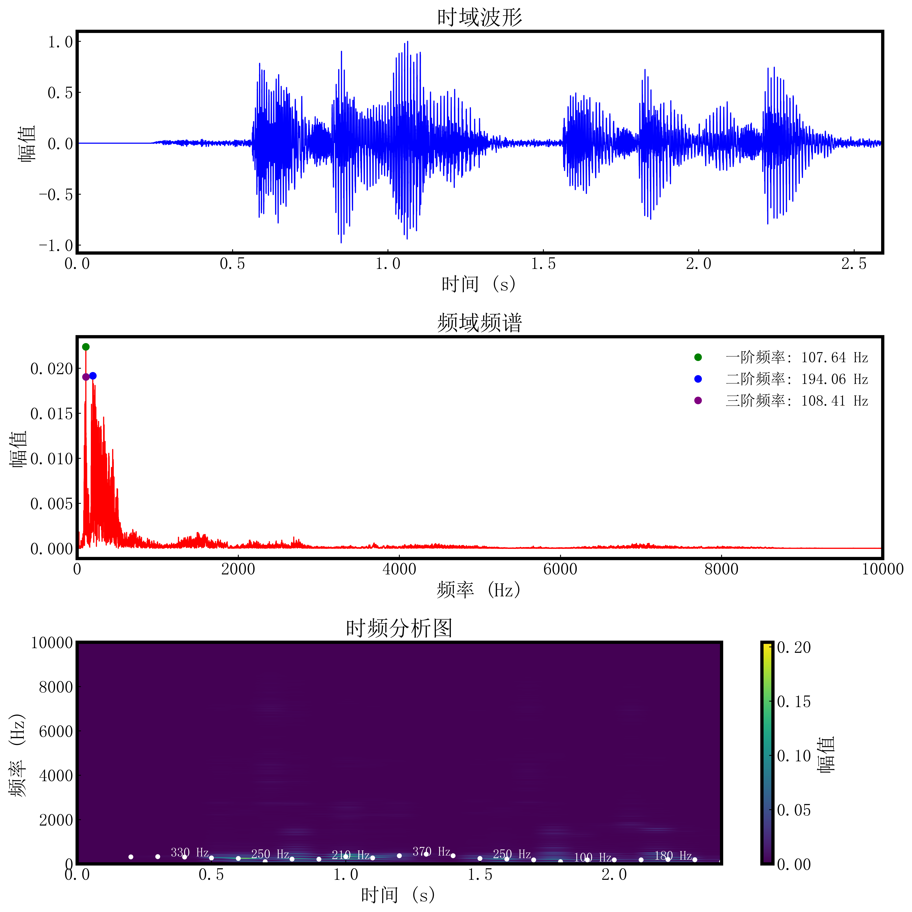

# ManualMuse - STFT 音频分析工具

本项目是一个用于音频信号处理的Python工具集，主要功能包括：
1. 从MP3文件中提取音频幅值数据
2. 对音频数据进行傅里叶变换(FFT)和短时傅里叶变换(STFT)
3. 生成频谱分析结果和可视化图表

## 主要功能

### 1. 音频幅值提取
- 从MP3文件中提取音频波形数据
- 支持自定义采样率（默认480Hz）
- 输出时间-幅值CSV文件

### 2. 频谱分析
- 傅里叶变换(FFT)分析音频频率成分
- 短时傅里叶变换(STFT)分析时频特性
- 自动检测主要频率峰值

### 3. 数据可视化

- 生成原始波形图
- 生成频谱图
- 生成时频热力图

### ⚙️ 安装依赖
```bash
pip install numpy matplotlib pydub pandas scipy
```

### 4. 使用方法

1. 准备音频文件，将.mp3格式的文件放入./MP3/目录下
2. 点击run_main.bat运行程序
3. 程序运行结束后，结果文件会保存在./output/目录下
